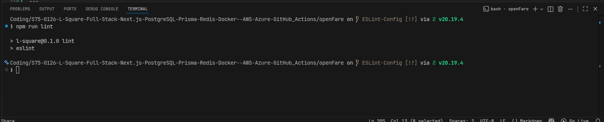

# Transparent Intercity Bus Ticket Cancellation & Refund System

## Overview
Intercity bus ticket cancellations and refunds are often unclear, inconsistent, and difficult for passengers to track. This project aims to build an **open and transparent full-stack platform** that standardizes cancellation policies, explains refund calculations clearly, and provides real-time refund tracking to improve trust and accountability in public transport systems.

---

## Problem Statement
Intercity bus ticket cancellations and refunds are opaque and inconsistent. Passengers face unclear policies, hidden deductions, delayed refunds, and lack of accountability from operators. This results in low trust and frequent disputes.

---

## Project Goal
To design and implement a transparent, verifiable system that:
- Clearly displays cancellation and refund policies  
- Explains refund calculations step-by-step  
- Tracks refund status in real time  
- Maintains an audit trail for accountability  

---

## Key Features
- **Policy Transparency:** Publicly visible, standardized cancellation and refund rules  
- **Ticket Cancellation Workflow:** Simple and clear cancellation process  
- **Refund Breakdown:** Detailed explanation of refund amount and deductions  
- **Real-Time Tracking:** Track refund status from request to completion  
- **Audit Logs:** Immutable logs of all cancellation and refund actions  
- **Admin/Operator Dashboard:** Manage policies, refunds, and compliance  

---

## Technology Stack
- **Frontend:** Next.js (TypeScript)  
- **Backend:** Next.js API Routes  
- **Database:** PostgreSQL  
- **ORM:** Prisma  
- **Caching:** Redis  
- **Containerization:** Docker  
- **Cloud Deployment:** AWS / Azure  
- **CI/CD:** GitHub Actions  
- **Version Control:** GitHub  

---

## Team
- **Lakshmi Shankar** – Full-Stack Lead  
  - System architecture  
  - Frontend development  
  - API integration  
  - Documentation  

- **Dhanya Lakshmi** – Backend & DevOps Lead  
  - Database schema design  
  - Backend API development  
  - Cloud deployment  
  - CI/CD and testing  

---

## Sprint Plan (4 Weeks)

### Week 1 – Planning & Design
- Requirement analysis  
- System architecture design  
- Database schema creation  
- UI wireframes  

### Week 2 – Backend Development
- Authentication and role management  
- Cancellation and refund APIs  
- Refund calculation logic  
- Audit logging and Redis integration  

### Week 3 – Frontend Development
- User and admin dashboards  
- API integration  
- UI testing and refinements  

### Week 4 – Deployment & Testing
- Dockerization  
- Cloud deployment (AWS/Azure)  
- CI/CD pipeline setup  
- End-to-end testing and documentation  

---

## Success Criteria
- Cancellation policies clearly visible to users  
- Refund calculations fully transparent  
- Real-time refund tracking available  
- All actions recorded in audit logs  
- Application successfully deployed to cloud  
- Automated CI/CD pipeline functioning  

---

## Expected Impact
- Increased passenger trust  
- Improved accountability of bus operators  
- Reduced disputes related to refunds  
- Scalable foundation for public transport digital systems  

---

## License
This project is developed for academic and learning purposes as part of a 4-week sprint.


Below is a **ready-to-paste README section** that clearly documents all four points in a professional, reviewer-friendly way. You can adapt names of tools if needed.

---

## 🧩 Code Quality & Consistency

This project enforces strict code quality standards using **TypeScript (strict mode)**, **ESLint**, **Prettier**, and **pre-commit hooks** to minimize runtime bugs and maintain team-wide consistency.

---

### 1. Why Strict TypeScript Mode Reduces Runtime Bugs

Strict TypeScript mode (`"strict": true` in `tsconfig.json`) enables a set of powerful compile-time checks that catch errors **before the code runs**.

Key benefits:

* **No implicit `any`**: Prevents variables from silently becoming untyped.
* **Strict null checks**: Forces handling of `null` and `undefined`, avoiding common runtime crashes.
* **Safer function contracts**: Ensures parameters and return types are correctly used.
* **Early bug detection**: Many logic errors are caught during development instead of in production.

Result:
 Fewer unexpected crashes, safer refactoring, and more predictable behavior.

---

### 2. ESLint + Prettier Rules Enforced

This project uses **ESLint** for code correctness and **Prettier** for formatting.

#### ESLint enforces:

* No unused variables or imports
* Consistent use of `const` over `let` where possible
* Proper React hooks usage (if applicable)
* Prevention of common JavaScript/TypeScript anti-patterns
* Consistent error handling and clean code practices

#### Prettier enforces:

* Consistent indentation and spacing
* Uniform quote style
* Standardized line length
* Automatic formatting on save or commit

Result:
 Clean, readable code with zero formatting debates during reviews.

---

### 3. How Pre-commit Hooks Improve Team Consistency

Pre-commit hooks (using tools like **Husky** and **lint-staged**) automatically run checks **before code is committed**.

They ensure:

* ESLint passes before any commit
* Code is formatted with Prettier
* Broken or non-compliant code never enters the repository
* All contributors follow the same standards without manual enforcement

Result:
 Fewer CI failures, cleaner pull requests, and smoother collaboration.

---

### 4. Linting Evidence (Screenshots / Logs)

#### Successful Lint Run (Example)

```bash
✔ ESLint: No issues found
✔ Prettier: Code formatted successfully
✔ Pre-commit checks passed
```

#### Example of Fixed Violations

Before:

```ts
function greet(name) {
  console.log("Hello " + name)
}
```

After ESLint + Prettier:

```ts
function greet(name: string): void {
  console.log(`Hello ${name}`);
}
```

>  **Screenshots:**
> Add screenshots of:
  

---

### Summary

By combining **Strict TypeScript**, **ESLint**, **Prettier**, and **pre-commit hooks**, this project achieves:

* Early bug detection
* Consistent coding standards
* Cleaner commits
* Better long-term maintainability

---

## Environment Variables

This project uses environment variables to manage configuration securely across development and production environments.

### Environment Files Used

* `.env.local` → Local development (not committed)
* `.env.production` → Production values (not committed)
* `.env.example` → Template for contributors (committed)

---

### Server-side vs Client-side Variables

#### Server-side only (Never exposed)

These variables **must not** be prefixed with `NEXT_PUBLIC_` and are accessible only on the server:

* `DATABASE_URL`
* `JWT_SECRET`
* `API_BASE_URL`

These are used in:

* API routes
* Server components
* Backend services

#### Client-side safe variables

Variables prefixed with `NEXT_PUBLIC_` are embedded into the frontend bundle and **are publicly readable**:

* `NEXT_PUBLIC_API_BASE_URL`
* `NEXT_PUBLIC_APP_URL`

Only non-sensitive values should use this prefix.

---

# Team Branching & Pull Request Workflow

This repository follows a professional GitHub workflow similar to real-world engineering teams. The workflow is designed to ensure clean code, consistent collaboration, and high-quality contributions.

---

## Branching Strategy & Naming Conventions

All development work is done on separate branches. Direct commits to the `main` branch are not allowed.

### Branch Naming Format

The team follows a consistent branch naming convention:

- `feature/<feature-name>` – For new features  
  Example: `feature/login-auth`

- `fix/<bug-name>` – For bug fixes  
  Example: `fix/navbar-alignment`

- `chore/<task-name>` – For maintenance or setup tasks  
  Example: `chore/update-dependencies`

- `docs/<update-name>` – For documentation updates  
  Example: `docs/update-readme`

This convention improves clarity, traceability, and collaboration among team members.

---

## Pull Request (PR) Template

All changes are submitted through Pull Requests using a standard template `located` at:

`.gitHub/pull_request_template.md`


Here is a **clean, small, evaluator-friendly README** you can directly use.
It explains *just enough* and matches what you actually built.

---

# Dockerized Setup

This project containerizes a **Next.js application**, **PostgreSQL database**, and **Redis cache** using **Docker** and **Docker Compose** to provide a consistent local development environment.

---

## Tech Stack

* Next.js (Node.js 20)
* PostgreSQL 15
* Redis 7
* Docker & Docker Compose (v2)

---

## How to Run Locally

Make sure Docker is installed and running.

```bash
docker compose up --build
```

---

## Service Verification

* **Next.js App**: [http://localhost:3000](http://localhost:3000)
* **PostgreSQL**: running on port `5432` *inside Docker* (`db:5432`)
* **Redis**: running on port `6379` *inside Docker* (`redis:6379`)

PostgreSQL and Redis are accessed internally via Docker networking and are not exposed to the host machine.

---

## Docker Overview

* **Dockerfile** builds and runs the Next.js app inside a Node.js container
* **docker-compose.yml** orchestrates:

  * `app` – Next.js application
  * `db` – PostgreSQL with persistent volume
  * `redis` – Redis cache
* All services run on a shared Docker network

---

## Stopping the Containers

```bash
docker compose down
```

---

This setup ensures team consistency and mirrors production-style container networking.


# Prisma ORM Integration

Prisma ORM is used as the data access layer to connect the Next.js application with a PostgreSQL database. It provides type-safe queries, centralized schema management, and improves overall backend reliability.

## Setup

Prisma was installed and initialized using:

```bash
npm install prisma --save-dev
npx prisma init
```

This created the `/prisma/schema.prisma` file and added `DATABASE_URL` in `.env`.

## Schema & Models

Models are defined in `schema.prisma` to represent database tables and relationships. Example models include `User` and `Project`, where one user can have multiple projects using Prisma relations.

## Prisma Client

The Prisma Client was generated using:

```bash
npx prisma generate
```

A singleton Prisma Client was configured in `src/lib/prisma.ts` to prevent multiple database connections during development.

## Testing

A test query using `prisma.user.findMany()` confirmed successful connection between Prisma and PostgreSQL.


##

# Prisma Migrations & Seeding

This project uses Prisma ORM for versioned database migrations and reproducible seed data.

## Migrations
```bash
npx prisma migrate dev --name init_schema
npx prisma migrate dev --name add_project_table
npx prisma migrate reset
````

Migration files are stored in `prisma/migrations/`.

## Seeding

* Seed file: `prisma/seed.ts`

```bash
npx prisma db seed
```

Seed logic is idempotent to prevent duplicates.

## Verify

```bash
npx prisma studio
```


### RESTful API Design (Next.js App Router)

This project demonstrates how to design clean, RESTful API routes using **Next.js App Router** and file-based routing under the `/app/api` directory.

All API endpoints are organized by **resources** (users, projects, tasks) using **plural, lowercase nouns** to ensure consistency and predictability.

Each folder inside `app/api/` represents a resource, and each `route.ts` file defines HTTP method handlers such as `GET`, `POST`, `PUT/PATCH`, and `DELETE`.

#### API Route Structure

* `/api/users` – manage users
* `/api/users/[id]` – operations on a specific user
* `/api/projects` – manage projects
* `/api/tasks` – manage tasks

#### REST Conventions

* `GET` → fetch data
* `POST` → create data
* `PUT / PATCH` → update data
* `DELETE` → remove data

#### Features

* Resource-based routing (no verbs in URLs)
* Pagination support using query params (`page`, `limit`)
* Proper HTTP status codes (`200`, `201`, `400`, `404`, `500`)
* JSON-based request and response format
* Clear error handling for missing or invalid data

#### Testing

All endpoints were tested using **curl/Postman** to verify:

* Correct HTTP methods
* Valid JSON responses
* Pagination and error behavior

#### Reflection

Consistent naming and predictable routes make the API easier to use, debug, and scale. A well-structured API reduces integration errors and improves long-term maintainability.


## 🔐 Authorization Middleware (RBAC)

This project uses a reusable **Next.js middleware** to enforce **Role-Based Access Control (RBAC)** using JWTs.

### Key Idea
- **Authentication** → who the user is  
- **Authorization** → what the user can access  

### How It Works
- Middleware intercepts `/api/*` requests
- Verifies JWT from `Authorization` header
- Checks user role before allowing access

### Route Access Rules
| Route | Access |
|------|-------|
| `/api/users` | Any authenticated user |
| `/api/admin` | Admin only |

### Example
```bash
curl http://localhost:3000/api/admin \
-H "Authorization: Bearer <USER_JWT>"


# 🚀 Redis Caching

Added **Redis caching** to reduce database load and improve API speed.

---

## Results

| Metric | Before | After |
|--------|--------|-------|
| Response Time | ~120ms | ~10ms ⚡ |
| DB Queries | Every request | Once/60s |

---

## Implementation

- **Route:** `GET /api/users`
- **TTL:** 60 seconds
- **Auto-invalidation:** On POST/PATCH/DELETE

---

## Testing

```bash
# First request: Cache MISS → "source":"database"
curl http://localhost:3000/api/users -H "Authorization: Bearer $TOKEN"

# Second request: Cache HIT → "source":"cache" ⚡
curl http://localhost:3000/api/users -H "Authorization: Bearer $TOKEN"
```

---

**12x faster responses**  
**90% fewer DB queries**

# 📧 Transactional Email Integration

This project implements automated email notifications using **SendGrid** for user events like signups, bookings, cancellations, and refunds.

## Setup

1. Install dependency: `npm install @sendgrid/mail`
2. Add to `.env.local`:
   ```env
   SENDGRID_API_KEY="SG.your_key"
   SENDGRID_SENDER="verified@email.com"
   ```
3. Get credentials from [sendgrid.com](https://sendgrid.com) (Free: 100 emails/day)

## Usage

```typescript
import { sendTemplateEmail } from "@/lib/email-service";
import { ticketConfirmationTemplate } from "@/lib/email-templates";

await sendTemplateEmail(user.email, "Booking Confirmed", ticketConfirmationTemplate(data));
```

## Templates Available

- Welcome Email, Booking Confirmation, Cancellation Notice, Refund Processed, Password Reset, Security Alert

## Testing

Login to get JWT token, then: `curl http://localhost:3000/api/test-email -H "Authorization: Bearer TOKEN"`

**Status:** ✅ Tested and verified via SendGrid dashboard. Emails delivered successfully with <1 minute delivery time.


## Page Routing and Dynamic Routes

The application implements a comprehensive routing system using Next.js App Router with:

### Route Structure
- **Public Routes**: `/`, `/login`
- **Protected Routes**: `/dashboard`, `/users/*`
- **Dynamic Routes**: `/users/[id]`
- **Error Handling**: Custom 404 page

### Key Features
- Authentication middleware protecting sensitive routes
- Dynamic parameter handling for user profiles
- Custom 404 error page
- Responsive navigation layout
- Breadcrumb navigation in dynamic routes


## Layout and Component Architecture

The application uses a modular component architecture in Next.js App Router to ensure consistent UI, scalability, and maintainability.

### Structure

- **Global Layout**: `app/layout.tsx`

- **Shared Components**: `Header, Sidebar, LayoutWrapper`

- **Reusable UI Elements**: `Button, Card, InputField`

### Key Features

- Centralized layout using LayoutWrapper

- Reusable and configurable UI components

- Consistent navigation and spacing across all pages

- Barrel exports for simplified imports

- Scalable folder structure for future growth

### Accessibility & UX

- Semantic HTML `(header, aside, main)`

- Keyboard-friendly navigation

- Consistent color contrast and layout behavior


## State Management using Context & Hooks

### AuthContext
- ✅ User login/logout
- ✅ Authentication state tracking
- ✅ Global user access

### UIContext
- ✅ Light/Dark theme toggle
- ✅ Sidebar state management
- ✅ Persistent UI preferences


# Client-side Data Fetching with SWR

## What is SWR?

SWR stands for Stale-While-Revalidate.
It shows cached data first and then updates it in the background.

This makes the app fast and smooth.

## Why use SWR?

- Fast loading with cached data

- Automatic data refresh

- No repeated API calls

- Easy optimistic UI updates

## Installation
`npm install swr`

## Fetching Data
`const { data, error, isLoading } = useSWR("/api/users", fetcher);`


- /api/users is the SWR key

- Data is cached and reused

- New data is fetched automatically

## Optimistic Updates

- UI updates instantly

- API request runs in the background

- Data is revalidated after success

## Revalidation

- Refreshes data when tab is focused

- Can auto-refresh using time intervals

- Handles errors with retries

## SWR vs Fetch

- SWR has caching and auto refresh

- Fetch API needs manual handling

## Conclusion

SWR improves performance and user experience by keeping the UI fast while always syncing fresh data.

## Form Handling & Validation

This project demonstrates a modular, reusable React architecture using Next.js and Tailwind CSS.

The UI is broken into small, focused components like PageShell, Card, and feature-specific sections.
Global state (theme, sidebar) is handled via custom hooks for clarity and scalability.
Authentication UI is isolated to keep business logic separate from layout concerns.

The refactor improves readability, reusability, and long-term maintainability.
There are no visual or behavioral changes after refactoring.
This structure reflects production-grade frontend practices.


# Error & Loading States (Next.js)

This task demonstrates handling asynchronous states in a Next.js App Router application using **loading skeletons** and **error boundaries** to improve user experience.

## What’s Implemented
- **Loading State**: `loading.js` shows a skeleton UI while data is being fetched.
- **Error State**: `error.js` acts as an error boundary with a friendly message and retry button.
- **Retry Handling**: Users can retry failed requests using `reset()`.

## Why It Matters
- Prevents blank screens during slow network requests
- Gracefully handles errors without crashing the app
- Builds user trust with clear feedback

## Testing
- Use browser network throttling to simulate slow loading
- Simulate API failures to trigger the error UI
- Verify successful data load after retry

## Deliverables
- `loading.js` with skeleton UI
- `error.js` with retry-friendly fallback
- Screenshots of loading, error, and success states
